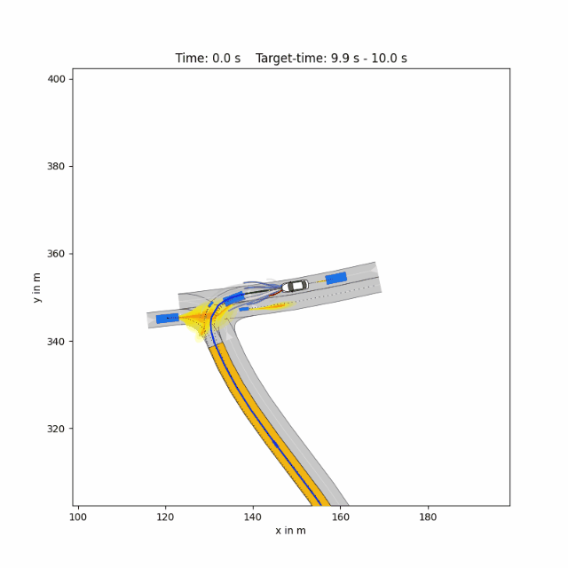
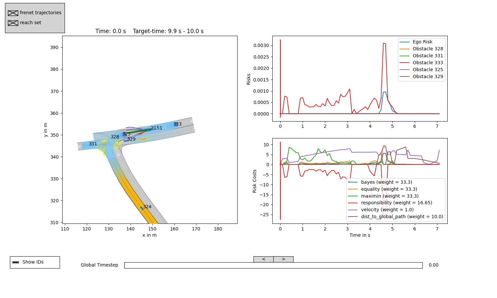

# Cog Enc for Dec Mak

This README.md details how to reproduce the results in our paper.

## System Requirements
* Operating System: Linux Ubuntu 20.04 (recommended) or MacOS (only for demo)
* Programming Language: Python 3.8

## Installation

An isolated virtual environment is recommended for installation (such as Conda). The installation of this repository is shown as follows.

1. Clone this repository with:

    `git clone https://github.com/Meta-Drive-Lab/Cog_Dec_Mak.git`

2. Navigate to the root folder of the repository (`[..]/Cog_Dec_Mak`) and install requirements:

    `pip install -r requirements.txt`

3. Download the required scenarios from [CommonRoad scenarios](https://gitlab.lrz.de/tum-cps/commonroad-scenarios) by:

    `git clone https://gitlab.lrz.de/tum-cps/commonroad-scenarios`

    Thus, you will have the following folder structure:

    ```
    ├── Cog_Dec_Mak (This repository)
      ├── commonroad-scenarios
    ```
    

## Quick Start Demo

To run the ethical planner on an exemplary default scenario, execute the following command from the root directory of this repository:
    
* `python planner/Frenet/frenet_planner.py`



You will see a live visualization of the demo.
Now you can start with your own experiments by changing the [configs](/planner/Frenet/configs/README.md) or selecting another scenario by adding

* `--scenario <path-to-scenario>`

to the command.

By default logs are saved and can be analyzed afterwards by running:

* `python planner/Frenet/analyze_tools/analyze_log.py`


[](/readme/analysis.jpg)

The curves of velocity and acceleration can be seen by running `python plot_vel_acc.py`.


## How to reproduce results

The following describes how the results from the paper can be reproduced. 

To evaluate the proposed method over all 2000 scenarios, please run:

* `python planner/Frenet/plannertools/evaluatefrenet.py --weights ethical --all`

Please note that at least 200 GB space left is required on your device for saving the log files. For better runtime, we recommend using [multiprocessing](/planner/Frenet/plannertools/evaluatefrenet.py#L46) and a [GPU](planner/Frenet/configs/prediction.json#L4) for the prediction network (RTX3090 used in our work). Evaluating all scenarios in 10 parallel threads with a GPU takes around 48 hours (sometimes longer, depends on your computational resources). Results and logfiles for each run are stored in `planner/Frenet/results`.

After tesing, standard evaluation metrics relevant to our paper such as the cummulated harm from 2000 benchmark scenarios can be seen within the results (`results/eval/harm.json`). 

## Extensions

We have added two additional modules to extend the original framework:

### 🔁 Active_Inference

This folder contains our implementation of **Active Inference-based decision-making**. 

### 🧭 visualize_tool

This folder provides **custom visualization tools** for inspecting trajectory planning results, including plots and risk distribution across timesteps. 
