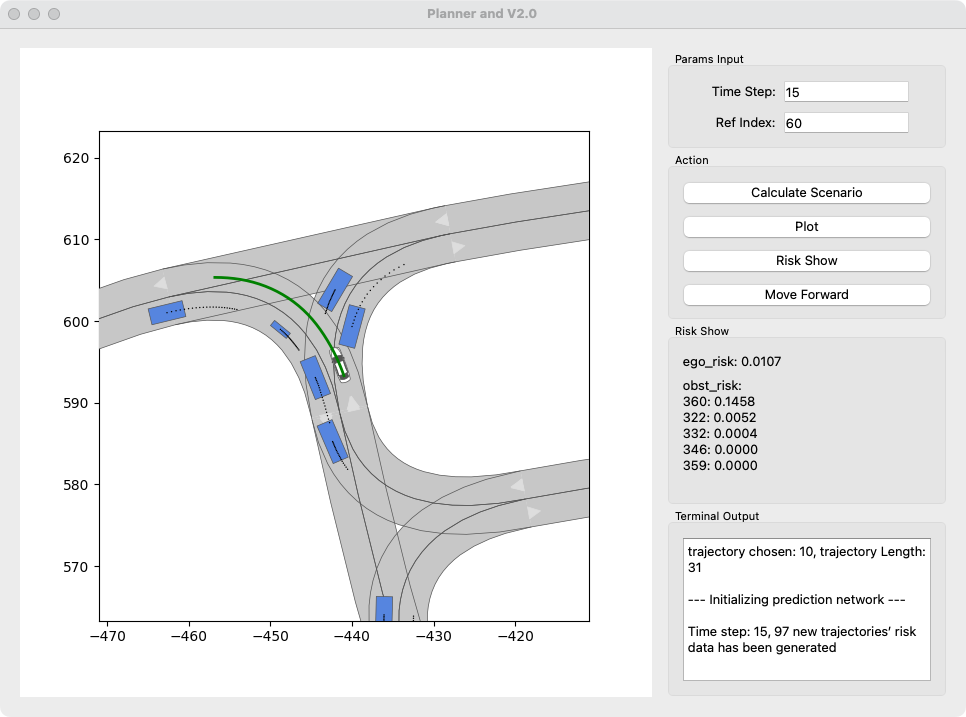

# 🚗 Planner and Risk Visualization Tool (v2.0)

A PyQt5-based GUI tool for scenario-based trajectory planning, risk evaluation, and visualization in autonomous driving. This tool loads driving scenarios from XML, runs a trajectory planner, computes risk values for ego and obstacle vehicles, and provides an interactive GUI for exploration and visualization.

---

## 🧩 Features

- ✅ Load and parse scenario XML files
- ✅ Initialize and simulate a planning module (`PlannerINTR`)
- ✅ Compute risk values for ego and obstacles
- ✅ Visualize scenario and planned trajectories using Matplotlib
- ✅ Interactively move forward in simulation and select trajectory
- ✅ GUI built with PyQt5 and integrated output console

---

## 🛠 Requirements

- Python 3.7+
- PyQt5
- matplotlib
- numpy

Install dependencies:

```bash
pip install PyQt5 matplotlib numpy
```


---

## 📁 File Structure

├── main.py                 # GUI entry point (this script) \
├── planner_intr.py         # Planning logic (trajectory generation and risk computation) \
├── visualization.py        # Scenario and trajectory plotting \
├── msg_logger.py           # Console output redirector for QTextEdit \
├── scenarios/ \
│   └── ESP_Cambre-3_4_T-1.xml   # Example scenario file


---

## 🚀 How to Run

Run the application with the following command:
```
python main.py
```
Ensure that the file path specified in main.py points to a valid scenario XML file.

---

## 🖥 GUI Overview

🧮 Params Input
	•	Time Step: Initial time step for planning
	•	Ref Index: Starting index for planning reference trajectory

🕹 Action Buttons
	•	Calculate Scenario: Initialize planner and generate risk trajectories
	•	Plot: Visualize current chosen trajectory over the scenario map
	•	Risk Show: Display current ego and obstacle risk values
	•	Move Forward: Move ego vehicle forward and plan

📊 Risk Display

Displays:
	•	Ego risk value for current trajectory
	•	Obstacle risk values for the same trajectory

💬 Terminal Output

A scrollable text box captures print() logs via StdoutRedirector and shows them in real time in the GUI.

---

## 📌 Example Scenario Used
```
MainWindow("scenarios/ESP_Cambre-3_4_T-1.xml")
```
You can replace this with any XML scenario file compatible with PlannerINTR.

Example alternatives: \
	•	DEU_Flensburg-96_1_T-1.xml \
	•	DEU_Ibbenbueren-14_1_T-1.xml

---

## 📷 Screenshot (Optional)

You can add a screenshot here using:




---

## 📝 License

This project is released under the MIT License. See LICENSE for details.

---